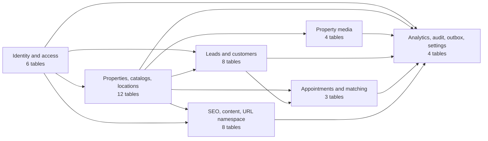
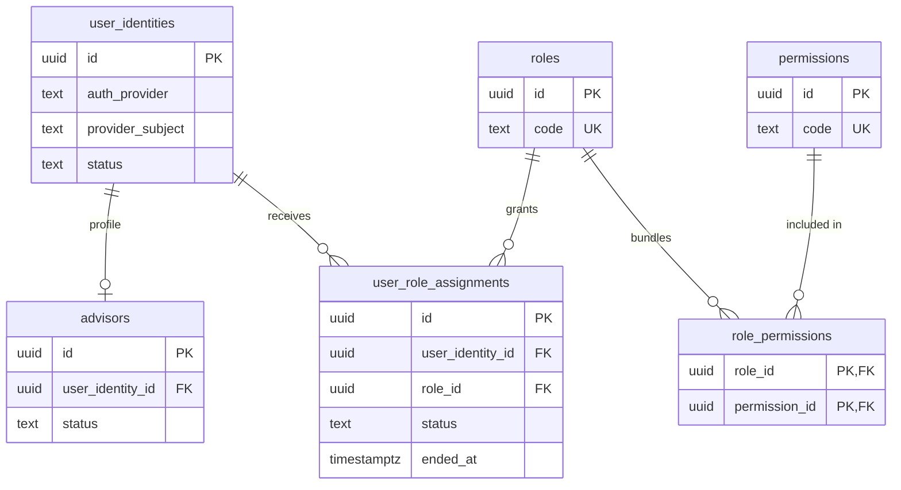
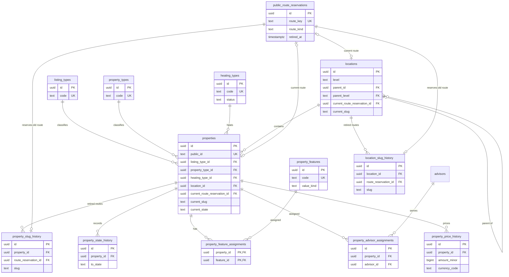
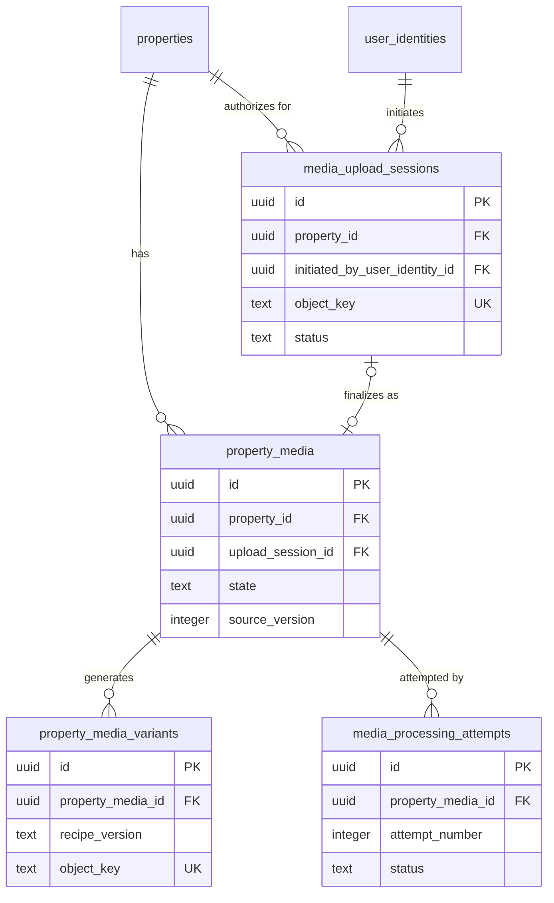
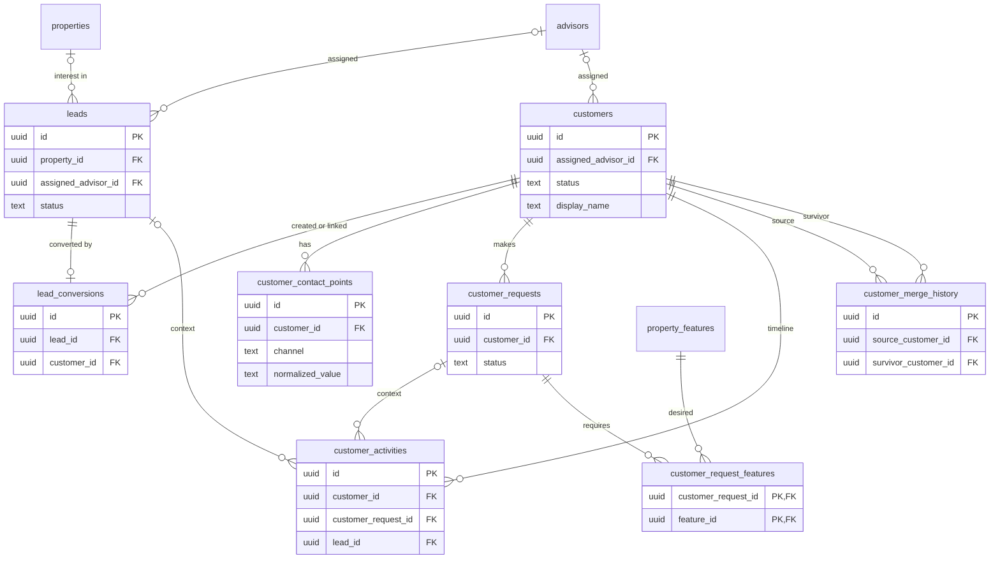
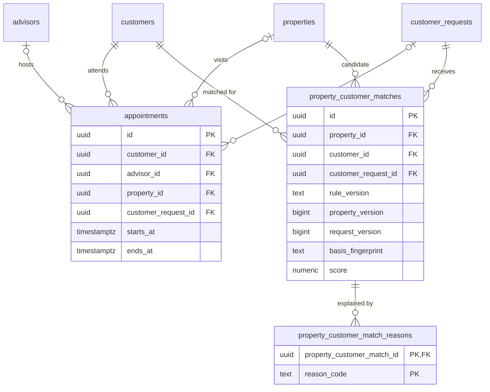
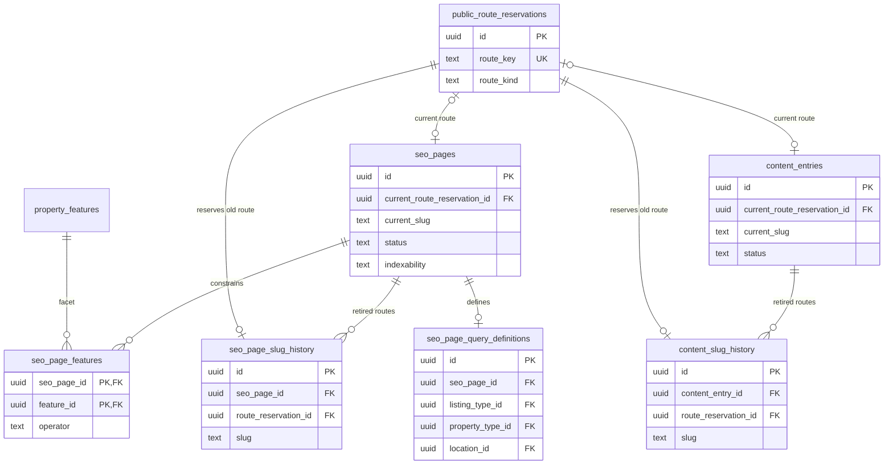
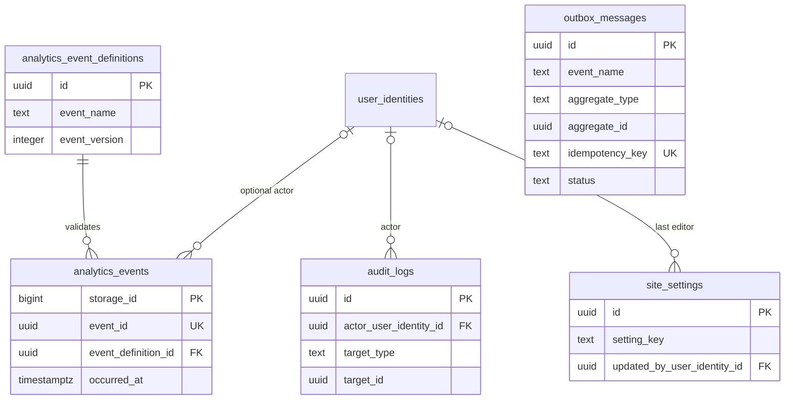

# Entity relationship diagrams

## Scope

These Mermaid diagrams cover all 45 tables. The overview shows ownership/dependency direction; bounded-context diagrams show table cardinalities. Logical references from analytics, audit, and outbox payloads are intentionally not polymorphic foreign keys. See [Relationships](relationships.md) for delete/restore rules, [Schema draft](schema-draft.md) for columns, [Entity catalog](entity-catalog.md) for lifecycle/security, and [Domain model](domain-model.md) for invariants.

## Cross-domain overview

The overview counts `public_route_reservations` in SEO/content and counts location slug history with the property/location context, totaling 45.

## Identity and access

## Properties, catalogs, locations, and routes

## Property media

## Leads and customers

## Appointments and matching

## SEO, content, and URL namespace

## Analytics, audit, integration, and settings

`audit_logs.target_type/target_id`, `outbox_messages.aggregate_type/aggregate_id`, and any analytics entity reference are logical, typed references without polymorphic FKs. Their owners validate target existence/authorization when writing or replaying; they cannot create circular aggregate ownership.
